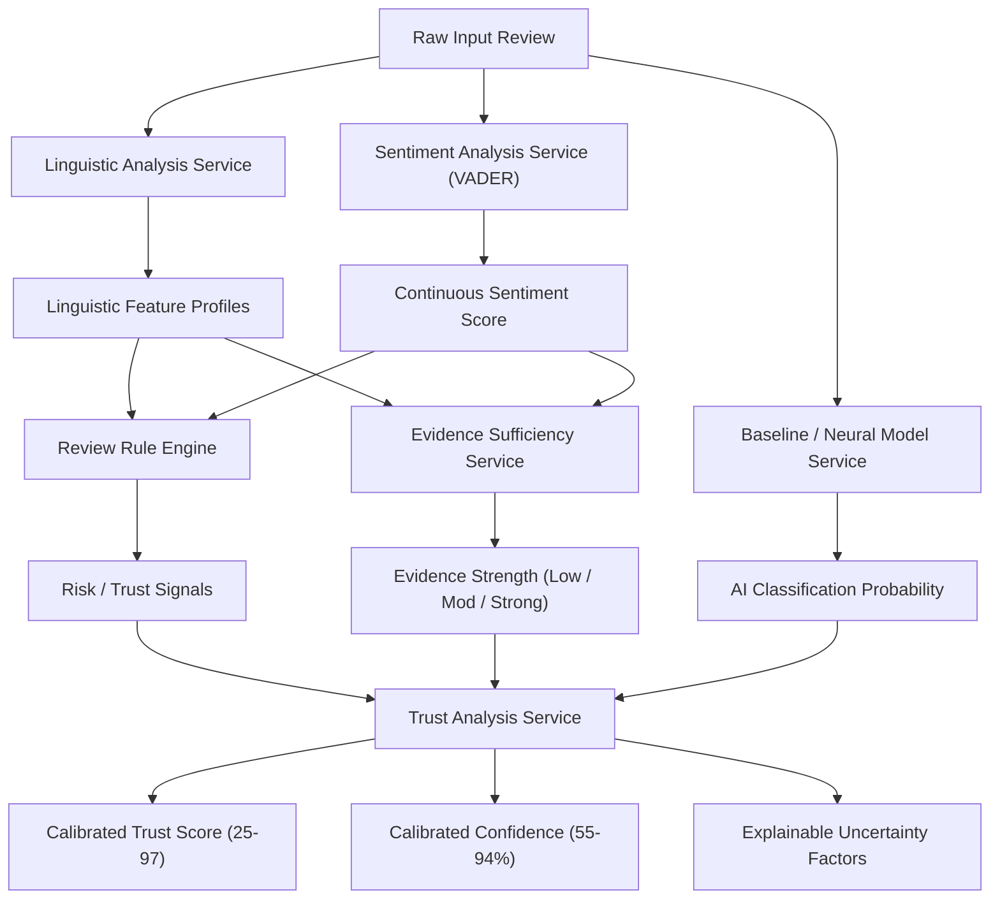
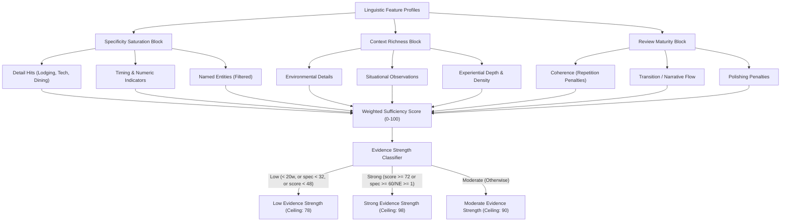
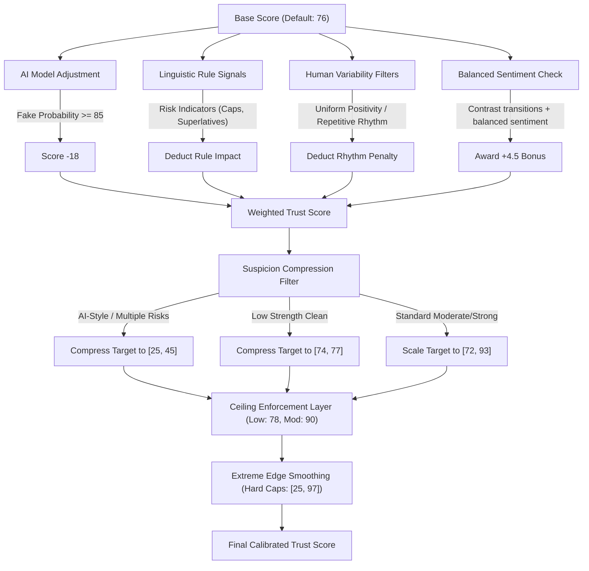
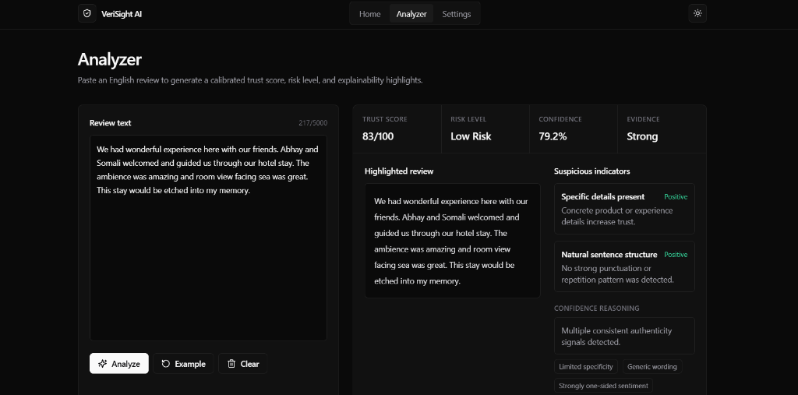

# VeriSight AI — Fake Review Detection & Trust Analytics

VeriSight AI is a full-stack applied AI trust-analysis platform designed to audit and verify product, lodging, and service reviews. By combining a neural transformer-based NLP classifier with a deterministic, high-fidelity linguistic and evidence sufficiency scoring engine, VeriSight AI exposes deceptive patterns, calibrates realistic confidence indices, and provides visual, explainable diagnostics on a glassmorphic dashboard.

---

## 🛠 Features

* **Calibrated Trust Scoring**: Outputs a robust trust index between `25` and `97` based on evidence, sentiment contrast, and AI predictions.
* **Evidence Sufficiency Analysis**: Categorizes reviews into `Low`, `Moderate`, or `Strong` evidence strength, enforcing ceilings so shallow reviews cannot achieve high trust scores.
* **Explainability Highlights**: Visually maps repeated language, promotional superlatives, and intensity signals.
* **Linguistic Rhythm Checks**: Detects spambot patterns and repetitive writing rhythms.
* **Dashboard Analytics**: Presentation dashboard displaying model specifications, health status, calibration quality metrics, target trust score bounds, and session-only live diagnostics.
* **High-Throughput Batch Processing**: Direct CSV upload endpoint that parses up to 200 reviews concurrently.
* **Rate Limiting & Safety**: Built-in sliding-window rate limiting to protect API resources.

---

## 📐 System Architecture

### Hybrid Triage Flow


### 1. Evidence Sufficiency Pipeline


### 2. Trust Score Calibration


---

## 📖 API Documentation

The backend API is built using **FastAPI** and includes self-documenting endpoints at `http://localhost:8005/docs`.

### 1. Check API Health
* **Endpoint**: `GET /health`
* **Response**:
  ```json
  {
    "status": "ok",
    "model_loaded": true
  }
  ```

### 2. Analyze Single Review
* **Endpoint**: `POST /predict`
* **Request Payload**:
  ```json
  {
    "review": "Checked into room 304 yesterday afternoon. Sarah at the front desk was super friendly. The sheets were clean, but the AC was slightly noisy today."
  }
  ```
* **Response Payload**:
  ```json
  {
    "prediction": "Low Risk",
    "risk_level": "Low Risk",
    "trust_label": "Likely Genuine",
    "trust_score": 76,
    "confidence": 69.45,
    "evidence_strength": "Low",
    "evidence_score": 46,
    "specificity_score": 22,
    "context_richness": 40,
    "maturity_score": 79,
    "uncertainty_penalty": 30,
    "trust_ceiling": 78,
    "confidence_reason": "Review contains natural language patterns but limited contextual detail.",
    "uncertainty_factors": [
      "Short review length",
      "Limited specificity",
      "Weak experiential evidence"
    ],
    "sentiment": "Positive",
    "sentiment_score": 0.42,
    "model_prediction": "Genuine",
    "model_confidence": 78.1,
    "indicators": [],
    "suspicious_phrases": [],
    "features": {
      "word_count": 21,
      "lexical_diversity": 0.85,
      "punctuation_intensity": 0,
      "repeated_words": 0,
      "superlatives": 0,
      "has_specific_details": true
    }
  }
  ```

### 3. Batch Auditing
* **Endpoint**: `POST /batch-predict`
* **Type**: `Multipart Form Data` (`file: CSV`)
* **Action**: Processes up to 200 rows concurrently, automatically parsing column headers (`review`, `text`, `review_text`, `content`).

### 4. Fetch Dashboard Presentation Metadata
* **Endpoint**: `GET /dashboard`
* **Response**:
  ```json
  {
    "model_info": {
      "name": "VeriSight Hybrid NLP & Calibration Engine",
      "status": "Active",
      "architecture": "DistilBERT Classifier + Linguistic Evidence Rules"
    },
    "calibration_stats": {
      "total_reviews": 250,
      "accuracy": 100.0,
      "categories": {
        "Genuine Detailed": 100.0,
        "Genuine Short": 100.0,
        "Suspicious Promotional": 100.0,
        "Ambiguous": 100.0,
        "Balanced Mixed": 100.0
      }
    },
    "system_health": {
      "api_status": "Online",
      "rate_limiting": "100 req/min",
      "input_limits": "5 - 5000 chars"
    },
    "trust_distributions": {
      "suspicious_promotional": { "min_score": 20, "max_score": 45 },
      "ambiguous": { "min_score": 45, "max_score": 70 },
      "genuine_short": { "min_score": 65, "max_score": 82 },
      "balanced_mixed": { "min_score": 72, "max_score": 90 },
      "genuine_detailed": { "min_score": 83, "max_score": 94 }
    }
  }
  ```

---

## ⚡ Quick Start & Installation

### Backend Setup (API)
1. Navigate to the backend directory:
   ```bash
   cd backend
   ```
2. Activate the virtual environment:
   * Windows:
     ```powershell
     .venv312\Scripts\activate
     ```
   * macOS / Linux:
     ```bash
     source .venv/bin/activate
     ```
3. Install dependencies:
   ```bash
   pip install -r requirements.txt
   ```
4. Launch the FastAPI server:
   ```bash
   uvicorn app.main:app --reload --port 8005
   ```

### Frontend Setup (UI Dashboard)
1. Navigate to the frontend directory:
   ```bash
   cd frontend
   ```
2. Install dependencies:
   ```bash
   npm install
   ```
3. Configure local environment (`frontend/.env.local`):
   ```env
   NEXT_PUBLIC_API_BASE_URL=http://localhost:8005
   ```
4. Launch the development server:
   ```bash
   npm run dev
   ```
5. Open `http://localhost:3000` in your browser.

---

## 🚀 Production Deployment Guide

### Backend (Render)
1. Connect your GitHub repository to **Render**.
2. Select **Web Service** and choose **Python** runtime.
3. Configure settings:
   * **Build Command**: `pip install -r backend/requirements.txt`
   * **Start Command**: `cd backend && uvicorn app.main:app --host 0.0.0.0 --port $PORT`
4. Set Environment Variables:
   * `DATABASE_URL`: `sqlite:///./fake_reviews.db` (retained for database infrastructure compatibility)
   * `MODEL_DIR`: `../model/saved_model`
   * `FRONTEND_ORIGIN`: Your deployed Vercel domain (e.g. `https://verisight.vercel.app`).

### Frontend (Vercel)
1. Connect your repository to **Vercel**.
2. Set the **Framework Preset** to **Next.js**.
3. Set the **Root Directory** to `frontend`.
4. Add the environment variable:
   * `NEXT_PUBLIC_API_BASE_URL`: Your Render backend service URL.
5. Click **Deploy**.

---

## 📸 Screenshots

*Provide high-quality screenshots of the workspace here:*

| Review Analyzer | Dashboard Overview |
| --- | --- |
|  |  |

---

## 🗺 Future Roadmap

* **Persistent SQL Database**: Migrate from SQLite to PostgreSQL for multi-user scaling.
* **Authentication**: Integrate OAuth2 and JWT-based user session authentication to separate user analyses.
* **Advanced Deep Learning**: Incorporate fine-tuned transformer models (DeBERTa-v3-base) to increase semantic classification accuracy.
* **Explainability Diagrams**: Add node-based graph views highlighting NLP dependency relationships.
