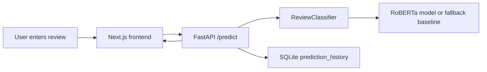

# Project Architecture

The system has three layers:

1. Frontend: Next.js renders the user workflow, dashboard, CSV upload, and dark-mode UI.
2. Backend: FastAPI validates requests, runs inference, stores history in SQLite, and exposes dashboard metrics.
3. ML: Hugging Face Transformers fine-tunes RoBERTa/BERT on the Deceptive Opinion Spam Corpus.

## Data Flow

## Model Lifecycle

- `model/preprocess.py` loads and cleans dataset rows.
- `model/train.py` tokenizes, splits, fine-tunes, evaluates, and saves the transformer.
- `backend/app/services/model_service.py` loads the saved model for inference.

## Database

SQLite stores each prediction with review text, predicted label, confidence, sentiment, and timestamp.
